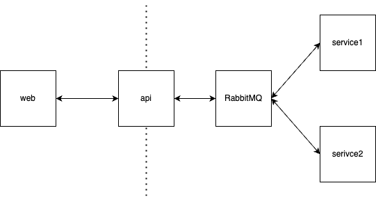

# Massive

This repository provides a small-to-medium starter package for
companies looking to adopt a microservices architecture. It aims to
help organizations begin effectively, offering a solid foundation
for their initial set of services.



## Ingredients

**RabbitMQ & GoLevelUp**  
Favour message distribution via routing keys over an exchange versus peer-to-peer REST interfaces that slowly grow more complex to manage as your infrusture grows.

**Nrwl NX**  
Monorepo tooling for simplified addition of microservices and shared and/or dependant target execution

**NestJS**  
Structured, modular service framework with first-class support for countless additional open source technologies

**SocketIO**  
Managed connections and abstracted away RPC calls

**ReactJS & Material UI**  
Giant dev community with countless open source options for additional functionalities

## Prerequisites

Install Docker Desktop, NodeJS and pnpm.

## Running inside containers

```sh
# run the setup script
pnpm setup-containers

# launch the containers
docker compose up -d

# serve the web app locally as it's
# not built into the container yet.
pnpm nx serve web
```

## Running on the host

```sh
# run the setup script
pnpm setup-localhost

#terminal window 1
pnpm nx serve web

#terminal window 2
pnpm nx serve api

#terminal window 3
pnpm nx serve service1

#terminal window 4
pnpm nx serve service2
```

## Adding new projects

Nrwl NX has a variety of generators available. I chose Nest for the exemplified microservces.

```sh
pnpm nx g @nx/nest:application --name=my-service --directory="apps/my-service"
```

To generate a new library, use the following command.

```sh
pnpm nx g @nx/nest:library --name=my-library --directory="apps/my-library"
```
