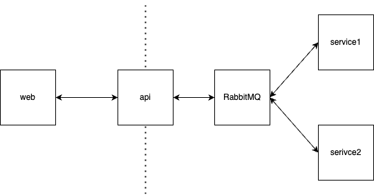

# Massive

The intention behind this repo is to demonstrate a simple microservices event driven architecture using RabbitMQ.



## Prerequisites

Install Docker Desktop, NodeJS and pnpm.

## Running inside containers

```sh
# run the setup script
pnpm setup-containers

# launch the containers
docker compose up -d

# serve the web app locally as it's
# not built into the container yet.
pnpm nx serve web
```

## Running on the host

```sh
# run the setup script
pnpm setup-localhost

#terminal window 1
pnpm nx serve web

#terminal window 2
pnpm nx serve api

#terminal window 3
pnpm nx serve service1

#terminal window 4
pnpm nx serve service2
```

## Add new projects

Nrwl NX has a variety of generators available. I chose Nest for the exemplified microservces.

```sh
pnpm nx g @nx/nest:application --name=my-service --directory="apps/my-service"
```

To generate a new library, use the following command.

```sh
pnpm nx g @nx/nest:library --name=my-library --directory="apps/my-library"
```
